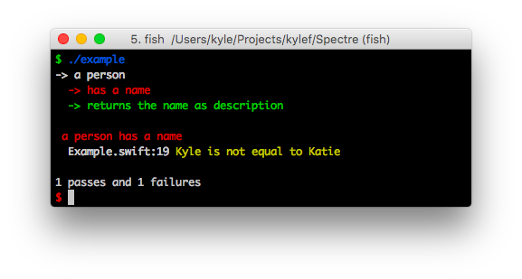
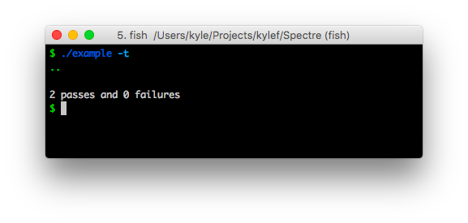
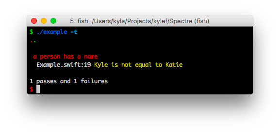
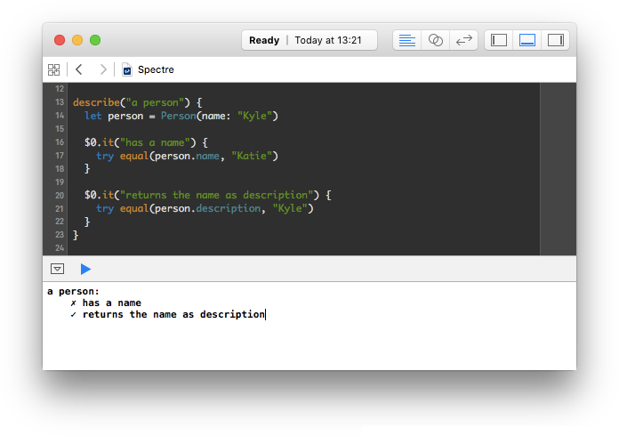

# Spectre

[](https://travis-ci.org/kylef/Spectre)

[*Sp*ecial *E*xecutive for *C*ommand-line *T*est *R*unning and
*E*xecution](https://en.wikipedia.org/wiki/SPECTRE).

A behavior-driven development (BDD) framework and test runner for Swift projects
and playgrounds. It is Foundation-free and Linux-ready!


## Usage

```swift
describe("a person") {
  let person = Person(name: "Kyle")

  $0.it("has a name") {
    try expect(person.name) == "Kyle"
  }

  $0.it("returns the name as description") {
    try expect(person.description) == "Kyle"
  }
}
```

### Reporters

Spectre currently has two built-in reporters, Standard and the Dot reporter.
Custom reporters are supported, simply make a type that conforms to `Reporter`.

- Standard
- Dot Reporter (`-t`)
- Tap Reporter (`--tap)` - [Test Anything Protocol](http://testanything.org/)-compatible output

#### Standard

The standard reporter produces output as follows:

##### Passing Tests


##### Failing Tests



#### Dot

Using the `-t` argument, you can use the dot reporter.

##### Passing Tests



##### Failing Tests



### Expectation

#### Equivalence

```swift
try expect(name) == "Kyle"
try expect(name) != "Kyle"
```

#### Truthiness

```swift
try expect(alive).to.beTrue()
try expect(alive).to.beFalse()
try expect(alive).to.beNil()
```

#### Error handling

```swift
try expect(try write()).to.throw()
try expect(try write()).to.throw(FileError.NoPermission)
```

#### Comparable

```swift
try expect(5) > 2
try expect(5) >= 2
try expect(5) < 10
try expect(5) <= 10
```

#### Causing a failure

```swift
throw failure("Everything is broken.")
```

#### Custom assertions

You can easily provide your own assertions, you just need to throw a
failure when the assertion does not meet expectaions.

## Examples

The following projects use Spectre:

| Project | CI |
|---------|----|
| [Inquiline](https://github.com/nestproject/Inquiline) | [](https://travis-ci.org/nestproject/Inquiline) |
| [CardKit](https://github.com/kylef/CardKit) | [](https://travis-ci.org/kylef/CardKit) |

## Installation / Running

### Conche

[Conche](https://github.com/kylef/Conche) build system has integrated support
for Spectre. You can simply add a `test_spec` to your Conche podspec depending
on Spectre and it will run your tests with `conche test`.

### Playground

You can use Spectre in an Xcode Playground, open `Spectre.playground` in
this repository, failures are printed in the console.



### Manually

You can build Spectre as a Framework or a library and link against it.

For example, if you clone Spectre and run `make` it will build a library you
can link against:

```shell
$ swiftc -I .conche/modules -L .conche/lib -lSpectre -o runner myTests.swift
$ ./runner
```
