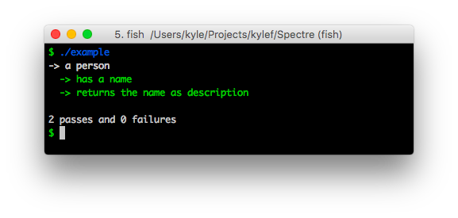

# Spectre

[](https://travis-ci.org/kylef/Spectre)

BDD Framework for Swift

## Usage

```swift
describe("a person") {
  let person = Person(name: "Kyle")

  $0.it("has a name") {
    try equal(person.name, "Kyle")
  }

  $0.it("returns the name as description") {
    try equal(person.description, "Kyle")
  }
}
```

##### Green



##### Failing Tests


### Assertions

#### `equal`

Assert two types are equal.

```swift
try equal(name, "Kyle")
```

#### `notEqual`

Assert two types are not equal.

```swift
try notEqual(name, "Kyle")
```

#### Causing a failure

```swift
try fail("Everything is broken.")
```

#### Custom assertions

You can easily provide your own assertions, you just need to call `fail` on
a failure.

### Reporters

Spectre currently has one standard reporter. There is an API to build your own
if you would like to. Just create a type that conforms to `Reporter` and pass
it to the `run` function.

## Installation / Running

### Conche

[Conche](https://github.com/kylef/Conche) build system has integrated support
for Spectre. You can simply add a `test_spec` to your Conche podspec depending
on Spectre and it will run your tests with `conche test`.

### Manually

You can build Spectre as a Framework or a library and link against it.

For example, if you clone Spectre and run `make` it will build a library you
can link against:

```shell
$ swiftc -I .conche/modules -L .conche/lib -lSpectre -o runner myTests.swift
$ ./runner
```

